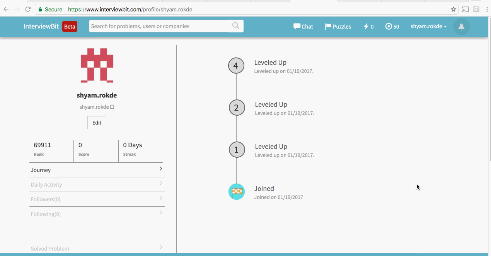

# Alumni Interview Pre-work

Repository has code solution for complex problems 

## Video Walkthrough 

Here's a walkthrough of completed Checkpoints:

GIF created with [LiceCap](http://www.cockos.com/licecap/).

## Checkpoint 1: Time Complexity

**Solution:** O(n)

## Checkpoint 2: PRETTYPRINT

Print concentric rectangular pattern in a 2d matrix. 

Example:

Input: A = 4.  

Output:  
4 4 4 4 4 4 4  
4 3 3 3 3 3 4  
4 3 2 2 2 3 4  
4 3 2 1 2 3 4  
4 3 2 2 2 3 4  
4 3 3 3 3 3 4  
4 4 4 4 4 4 4  

**Solution:** [PrettyPrint.java](PrettyPrint.java)

## Checkpoint 3:

### 1. Kth Smallest Element in the Array

Find the kth smallest element in an unsorted array of non-negative integers.

Example:

Input:  
A : [2 1 4 3 2]  
k : 3  

Output: 2

**Solution:** [KthSmallest.java](KthSmallest.java)

### 2. NUMRANGE

Given an array of non negative integers A, and a range (B, C), find the number of continuous subsequences in the array which have sum S in the range [B, C] or B <= S <= C

Continuous subsequence is defined as all the numbers A[i], A[i + 1], .... A[j] where 0 <= i <= j < size(A)

Example:

Input:  
A : [10, 5, 1, 0, 2]  
B, C : (6, 8)  

Output: 3

**Solution:** [NumRange.java](NumRange.java)

## Checkpoint 4:

### 1. SUBTRACT

Given a singly linked list, modify the value of first half nodes such that :

1st node’s new value = the last node’s value - first node’s current value  
2nd node’s new value = the second last node’s value - 2nd node’s current value,  
and so on …

Example:

Given linked list 1 -> 2 -> 3 -> 4 -> 5,

You should return 4 -> 2 -> 3 -> 4 -> 5

**Solution:** [Subtract.java](Subtract.java)

